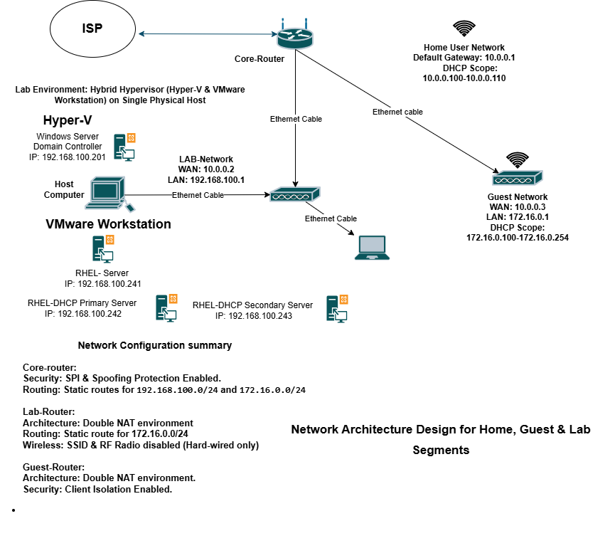

# Network Architecture Design
## Overview
This project documents a custom-built, secure network architecture designed for a home & lab environment. It emphasises network segmentation, defence-in-depth principles, and strict access control across three distinct zones.

## Documentation
```text
===============================================================================
                     NETWORKING ENGINEERING DESIGN DOCUMENT
===============================================================================
Project Name  : Secure Multi-Zone Network Infrastructure
Author        : Md. Arefin Haq
Date          : May 10, 2026
System Status : Fully Optimised
===============================================================================

[ 1. LOGICAL NETWORK TOPOLOGY ]

                           [ Internet (ISP) ]
                                   │
                           ┌───────┴───────┐
                           │  Main Router  │ ── (DHCP Pool: 10.0.0.100 - 10.0.0.110)
                           │   10.0.0.1    │    [ Family Wi-Fi / SPI Enabled ]
                           └───────┬───────┘
                                   │
         ┌─────────────────────────┴─────────────────────────┐
         ▼ (WAN: 10.0.0.2 Reserved)                          ▼ (WAN: 10.0.0.3 Reserved)
┌──────────────────┐                                ┌──────────────────┐
│    Lab Router    │                                │   Guest Router   │
│   192.168.100.1  │                                │   172.16.0.1     │
└────────┬─────────┘                                └────────┬─────────┘
         │ (RF/SSID Disabled - Wired Only)                   │ (Client Isolation Enabled)
         ├─► 192.168.100.253 (Laptop Reserved)               └─► DHCP Pool: 172.16.0.100 - .254
         ├─► 192.168.100.254 (Host Desktop Reserved)             [ Isolated Guest Zone ]
         ├─► 192.168.100.201 (Windows Server -Domain Controller) 
         ├─► 192.168.100.241 (RHEL-Lab Server)
         ├─► 192.168.100.242 (RHEL-DHCP Primary Server)
         └─► 192.168.100.243 (RHEL-DHCP Secondary Server)
         

===============================================================================
[ 2. SUBNET & IP ALLOCATION DIRECTORY ]
===============================================================================

A. CORE PERIMETER ZONE (Main Router)
   - Subnet Range     : 10.0.0.0/24
   - Primary Gateway  : 10.0.0.1
   - DHCP Scope       : 10.0.0.100 - 10.0.0.110
   - Static IP Leases : 10.0.0.2 -> Lab Router WAN, 10.0.0.3 -> Guest Router WAN

B. SANDBOX / DATA CENTER ZONE (Lab Router)
   - Subnet Range     : 192.168.100.0/24
   - Subnet Gateway   : 192.168.100.1
   - Static IP Leases : 192.168.100.253 (Laptop), 192.168.100.254 (Host)
   - Active Node Map  : 192.168.100.241 (RHEL-Lab), 192.168.100.242 (DHCP-Primary), 192.168.100.243 (DHCP-Secondary)
   - Offline Master   : RHEL-MS (Golden Baseline Image)

C. ISOLATED DMZ ZONE (Guest Router)
   - Subnet Range     : 172.16.0.0/24
   - Subnet Gateway   : 172.16.0.1
   - DHCP Scope       : 172.16.0.100 - 172.16.0.254

===============================================================================
[ 3. INTER-DOMAIN ROUTING SCHEME (STATIC ROUTES) ]
===============================================================================

1. Main Router Table:
   Destination Net | Subnet Mask   | Next Hop Gateway | Interface
   192.168.100.0   | 255.255.255.0 | 10.0.0.2         | LAN/WLAN
   172.16.0.0      | 255.255.255.0 | 10.0.0.3         | LAN/WLAN

2. Lab Router Table:
   Destination Net | Subnet Mask   | Next Hop Gateway | Interface
   172.16.0.0      | 255.255.255.0 | 10.0.0.3         | WAN Gateway

===============================================================================
[ 4. SECURITY & ZONE HARDENING METRICS ]
===============================================================================

* Stateful Packet Inspection (SPI): Enforced on Core Perimeter
* Wireless RF Suppression: Disabled on Lab Router
* Layer-2 Peer Isolation: Enabled on Guest Gateway
* Infrastructure Philosophy: Defence in Depth & Least Privilege Access

## Tech Stack
* Operating Systems: RHEL, Windows Server
* Virtualisation: [VMware Workstation & Hyper-V]
* Networking: Advanced Routing & Segmentation

## Status
* Status: Development Phase


===============================================================================
[ AUTHOR'S NOTE ]
===============================================================================
This Secure Multi-Zone Network Infrastructure is an original project, 
fully designed and implemented by Md. Arefin Haq.

License: This project is for educational and personal use only. Use at your own risk.
